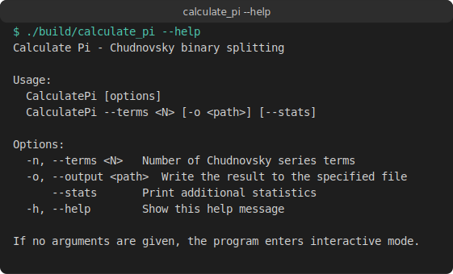
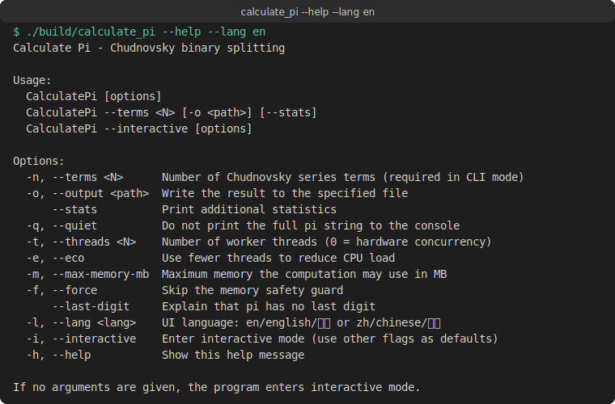
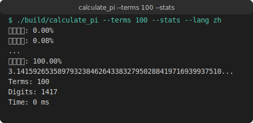

<div align="center">

# Calculate Pi · 计算圆周率 π

[](https://github.com/Codevolve-bilibili/Calculate-Pi/actions/workflows/ci.yml)
[](LICENSE)
[](https://en.cppreference.com/w/cpp/20)
[](https://cmake.org/)

</div>

> **中文**：一个基于 **Chudnovsky 二进制分裂算法** 的高精度 π 计算工具，使用 **C++20** 与 **CMake** 实现，支持命令行与交互式两种使用模式。计算过程中会实时显示**平滑的百分比进度**，覆盖开方、级数求和、除法和输出四个阶段。
>
> **English**: A high-precision π calculator based on the **Chudnovsky binary splitting algorithm**, implemented in **C++20** with **CMake**. It supports both command-line and interactive modes, and shows a **smooth real-time progress percentage** across the sqrt, series summation, division, and output phases.

---

## 📸 运行截图 / Screenshots

> 以下输出均为程序真实运行结果捕获。/ The outputs below are captured from real program executions.

### 帮助信息 / Help

#### 中文帮助 / Chinese help



```text
Calculate Pi - 楚德诺夫斯基二进制分裂算法

用法:
  CalculatePi [选项]
  CalculatePi --terms <N> [-o <路径>] [--stats]
  CalculatePi --infinite --terms <N> --step <S> --output <目录> [选项]
  CalculatePi --interactive [选项]

选项:
  -n, --terms <N>             楚德诺夫斯基级数项数（命令行模式下必需）
  -o, --output <路径>         将结果写入指定文件或目录
      --stats                 显示额外统计信息
  -q, --quiet                 不在控制台打印完整 π 字符串
  -t, --threads <N>           工作线程数（0 = 硬件并发数）
  -e, --eco                   使用更少线程以降低 CPU 负载
  -m, --max-memory-mb         计算允许使用的最大内存（MB）
  -f, --force                 跳过内存安全检查
      --last-digit            说明 π 没有最后一位
      --infinite              启用无限计算模式（CLI 专用）
      --step <N>              无限模式下每次增加的项数
      --infinite-max-files <N>  最多生成 N 个文件
      --infinite-max-time <N>   最长运行时间
      --infinite-max-time-unit <s/m/h>  时间单位（默认秒）
  -l, --lang <语言>           界面语言：en/english/英文 或 zh/chinese/中文
  -i, --interactive           进入交互模式（将其他标志作为默认值）
  -h, --help                  显示此帮助信息

若未提供任何参数，程序将进入交互模式。
```

#### English help



```text
Calculate Pi - Chudnovsky binary splitting

Usage:
  CalculatePi [options]
  CalculatePi --terms <N> [-o <path>] [--stats]
  CalculatePi --infinite --terms <N> --step <S> --output <dir> [options]
  CalculatePi --interactive [options]

Options:
  -n, --terms <N>             Number of Chudnovsky series terms (required in CLI mode)
  -o, --output <path>         Write the result to the specified file or directory
      --stats                 Print additional statistics
  -q, --quiet                 Do not print the full pi string to the console
  -t, --threads <N>           Number of worker threads (0 = hardware concurrency)
  -e, --eco                   Use fewer threads to reduce CPU load
  -m, --max-memory-mb         Maximum memory the computation may use in MB
  -f, --force                 Skip the memory safety guard
      --last-digit            Explain that pi has no last digit
      --infinite              Enable infinite computation mode (CLI only)
      --step <N>              Terms added per iteration in infinite mode
      --infinite-max-files <N> Generate at most N files
      --infinite-max-time <N>  Maximum total running time
      --infinite-max-time-unit <s/m/h> Time unit (default seconds)
  -l, --lang <lang>            UI language: en/english/英文 or zh/chinese/中文
  -i, --interactive           Enter interactive mode (use other flags as defaults)
  -h, --help                  Show this help message

If no arguments are given, the program enters interactive mode.
```

### 计算 100 项 / Compute 100 terms



```text
计算进度: 0.00%
计算进度: 0.08%
...（进度平滑增长）
计算进度: 100.00%
3.1415926535897932384626433832795028841971693993751058209749445923078164062862089986280348253421170679821480865132823066470938446095505822317253594081284811174502841027019385211055596446229489549303819644288109756659334461284756482337867831652712019091456485669234603486104543266482133936072602491412737245870066063155881748815209209628292540917153643678925903600113305305488204665213841469519415116094330572703657595919530921861173819326117931051185480744623799627495673518857527248912279381830119491298336733624406566430860213949463952247371907021798609437027705392171762931767523846748184676694051320005681271452635608277857713427577896091736371787214684409012249534301465495853710507922796892589235420199561121290219608640344181598136297747713099605187072113499999983729780499510597317328160963185950244594553469083026425223082533446850352619311881710100031378387528865875332083814206171776691473035982534904287554687311595628638823537875937519577818577805321712268066130019278766111959092164201989380952572010654858632788659361533818279682303019520353018529689957736225994138912497217752834791315155748572424541506959508295331168617278558890750983817546374649393192550604009277016711390098488240128583616035637076601047101819429555961989467678374494482553797747268471040475346462080466842590694912933136770289891521047521620569660240580381501935112533824300355876402474964732639141992726042699227967823547816360093
Terms: 100
Digits: 1417
Time: 0 ms
```

### 保存 1000 项结果到文件 / Save 1000 terms to file

```bash
./build/calculate_pi --terms 1000 --output pi_1000.txt --stats
```

```text
计算进度: 0.00%
...（进度平滑增长至 100.00%）
3.1415926535897932384626433832795028841971693993751058209749445923078164062862089986280348253421170679821480865132823066...
Terms: 1000
Digits: 14180
Time: 4 ms
```

---

## ✨ 功能特性 / Features

| 中文 | English |
|------|---------|
| 使用 Chudnovsky 二进制分裂算法计算 π | Computes π using the Chudnovsky binary splitting algorithm |
| 自研大整数 (`BigInt`)，支持 Naive、Karatsuba、FFT 与自适应乘法策略 | Custom `BigInt` with Naive, Karatsuba, FFT, and adaptive multiplication strategies |
| 基于 `std::thread` 的线程池实现并行递归分裂 | Thread pool based on `std::thread` for parallel recursive splitting |
| 支持命令行参数与交互式两种运行模式 | Supports both command-line arguments and interactive modes |
| 支持将计算结果保存到文件 | Supports saving results to a file |
| 内存安全 guard：估算所需内存并阻止危险大任务 | Memory safety guard: estimates required memory and blocks dangerous large tasks |
| 可调节线程数与节能模式 | Configurable thread count and eco mode |
| 安静输出与大结果提示 | Quiet output and large-result warnings |
| 中英文双语界面 | Bilingual Chinese/English UI |
| 跨平台：Windows、Linux、macOS | Cross-platform: Windows, Linux, macOS |
| **各阶段真实进度回调，百分比平滑增长** | **Real progress callbacks for each phase with smooth percentage growth** |

---

## 🛠️ 系统要求 / Requirements

- **中文**：C++20 兼容编译器、CMake 3.16 或更高版本、支持 `std::thread` 的平台。
- **English**: A C++20-compatible compiler, CMake 3.16 or later, and a platform supporting `std::thread`.

测试过的环境 / Tested environments:

- Windows 11 + MSVC / MinGW-w64
- Ubuntu 22.04 + GCC 11
- macOS 14 + Clang 15

---

## 🚀 构建与运行 / Build and Run

```bash
# 配置 / Configure
cmake -B build -S . -DCMAKE_BUILD_TYPE=Release

# 构建 / Build
cmake --build build --config Release

# 运行 / Run
./build/calculate_pi --terms 100 --stats        # Linux / macOS
./build/calculate_pi.exe --terms 100 --stats    # Windows
```

---

## 📖 使用方式 / Usage

### 命令行模式 / Command-line mode

```bash
# 显示帮助 / Show help（默认中文 / Chinese by default）
./build/calculate_pi --help

# 显示英文帮助 / Show English help
./build/calculate_pi --help --lang en
./build/calculate_pi --help --lang 英文

# 计算 N 项并输出到控制台 / Compute N terms and print to console
./build/calculate_pi --terms 100

# 同时显示统计信息 / Show statistics
./build/calculate_pi --terms 100 --stats

# 将结果保存到文件 / Save result to file
./build/calculate_pi --terms 1000 --output pi.txt --stats

# 使用单线程 / Use single thread
./build/calculate_pi --terms 1000 --threads 1 --stats

# 降低 CPU 占用 / Reduce CPU load
./build/calculate_pi --terms 1000 --eco --stats

# 安静模式（只输出统计） / Quiet mode (statistics only)
./build/calculate_pi --terms 1000 --quiet --stats

# 指定内存上限 / Set memory limit
./build/calculate_pi --terms 100000 --max-memory-mb 512 --stats

# 指定界面语言为英文 / Set UI language to English
./build/calculate_pi --terms 100 --stats --lang en

# π 的最后一位彩蛋 / Pi last digit easter egg
./build/calculate_pi --last-digit

# 无限计算模式：从 100 项开始，每次增加 100 项，保存到 ./out 目录
# Infinite mode: start at 100 terms, add 100 terms per iteration, save to ./out
./build/calculate_pi --infinite --terms 100 --step 100 --output ./out

# 限制生成 5 个文件 / Limit to 5 files
./build/calculate_pi --infinite --terms 100 --step 100 --output ./out --infinite-max-files 5

# 限制运行 30 秒 / Limit runtime to 30 seconds
./build/calculate_pi --infinite --terms 100 --step 100 --output ./out --infinite-max-time 30 --infinite-max-time-unit s
```

### 交互模式 / Interactive mode

不传递任何参数，或使用 `-i` / `--interactive` 标志，即可进入交互模式：

```bash
# 完整交互模式
./build/calculate_pi

# 用命令行选项作为默认值，缺失的值再交互式询问
./build/calculate_pi --interactive --terms 100
./build/calculate_pi --interactive -o pi.txt --stats
```

程序会依次询问（若已通过命令行指定则跳过）：

1. **语言**（`zh`/`中文` 或 `en`/`英文`）
2. 项数 `N`（正整数）
3. 是否保存到文件
4. 输出文件路径（如果回答“是”）
5. 是否显示统计信息
6. 是否开启安静模式（不打印 π 字符串）
7. 工作线程数（`0` 表示使用硬件并发数）
8. 是否开启节能模式（使用更少线程）
9. 最大内存限制（单位 MB，留空表示无限制）
10. 是否跳过内存安全 guard

Run without arguments, or use `-i` / `--interactive`, to enter interactive mode:

```bash
# Full interactive mode
./build/calculate_pi

# Use command-line options as defaults, then prompt for the rest
./build/calculate_pi --interactive --terms 100
./build/calculate_pi --interactive -o pi.txt --stats
```

The program will ask for the following (skipping any value already provided on the command line):

1. **Language** (`zh`/`中文` or `en`/`english`)
2. Number of terms `N` (positive integer)
3. Whether to save to a file
4. Output file path (if answered “yes”)
5. Whether to show statistics
6. Whether to enable quiet mode (do not print the pi string)
7. Number of worker threads (`0` means hardware concurrency)
8. Whether to enable eco mode (use fewer threads)
9. Maximum memory limit in MB (leave empty for no limit)
10. Whether to skip the memory safety guard

---

## 🏗️ 项目结构 / Project Structure

```text
Calculate Pi
├── .github/workflows/
│   └── ci.yml              # GitHub Actions 持续集成 / CI workflow
├── CMakeLists.txt          # CMake 构建配置 / Build configuration
├── LICENSE                 # MIT 许可证 / MIT license
├── README.md               # 本文件 / This file
├── include/cpi/            # 头文件 / Header files
│   ├── app.hpp             # 应用主逻辑 / Application logic
│   ├── bigint.hpp          # 大整数 / Big integer
│   ├── bigint_multiply.hpp # 乘法策略 / Multiplication strategies
│   ├── chudnovsky.hpp      # Chudnovsky 算法 / Chudnovsky algorithm
│   ├── cli.hpp             # 命令行解析 / CLI parsing
│   ├── concurrency.hpp     # 线程池 / Thread pool
│   ├── expected.hpp        # 轻量期望类型 / Lightweight expected type
│   ├── io.hpp              # 输入输出 / I/O utilities
│   └── sysinfo.hpp         # 系统信息 / System information
├── main.cpp                # 程序入口 / Program entry point
├── res/                    # Windows 资源文件 / Windows resource files
│   ├── Calculate-Pi.manifest
│   ├── Calculate-Pi.rc
│   ├── calculate_pi.ico
│   └── resource.h.in
└── src/                    # 源文件 / Source files
    ├── app.cpp
    ├── bigint.cpp
    ├── bigint_multiply.cpp
    ├── chudnovsky.cpp
    ├── cli.cpp
    ├── concurrency.cpp
    ├── io.cpp
    └── sysinfo.cpp
```

---

## 🧮 算法说明 / Algorithm Notes

本项目使用 [Chudnovsky 算法](https://en.wikipedia.org/wiki/Chudnovsky_algorithm) 计算 π：

```
1/π = 12 * Σ ((-1)^k * (6k)! * (13591409 + 545140134k)) / ((3k)! * (k!)^3 * 640320^(3k + 3/2))
```

This project uses the [Chudnovsky algorithm](https://en.wikipedia.org/wiki/Chudnovsky_algorithm) to compute π:

```
1/π = 12 * Σ ((-1)^k * (6k)! * (13591409 + 545140134k)) / ((3k)! * (k!)^3 * 640320^(3k + 3/2))
```

实现中采用 **二进制分裂**（binary splitting）将级数求和转化为递归的分治计算，并通过线程池对递归任务进行并行化，从而高效获得上百万位精度。

The implementation uses **binary splitting** to transform the series summation into recursive divide-and-conquer computations, parallelizing recursive tasks via a thread pool to efficiently obtain millions of digits of precision.

---

## 🤝 贡献 / Contributing

欢迎提交 Issue 和 Pull Request！

Issues and Pull Requests are welcome!

---

## 📄 许可证 / License

本项目采用 [MIT 许可证](LICENSE) 开源。

This project is open-sourced under the [MIT License](LICENSE).

Copyright (c) 2026 Calculate Pi project
